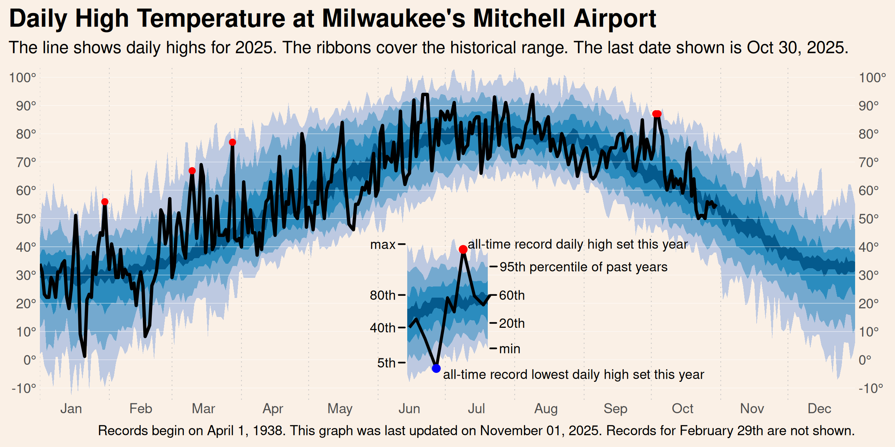

## Automated Tufte-style weather graphs

This repository creates the weather graph below (inspired by [Edward Tufte](https://www.edwardtufte.com/bboard/q-and-a-fetch-msg?msg_id=00014g)) using R's {{ggplot2}} package. Updated data is pulled directly from NOAA's FTP servers. The entire process is automated using Github Actions.

This repo may be useful for three kinds of users.

1. Those interested in replicating or adapting this graph for a different weather station
2. Those interested in learning more about data viz with ggplot2
3. Those interested in learning more about Github Actions with R

Full disclosure: I'm a novice Github Actions user. This repo reflects my best understanding of Github Actions, and I plan to update it has my skills improve.

## About this data

NOAA provides daily data for weather stations in the [Global Historical Climatological Network](https://www.ncei.noaa.gov/products/land-based-station/global-historical-climatology-network-daily) (GHCN). 

**Citation:**

Menne, M.J., I. Durre, B. Korzeniewski, S. McNeal, K. Thomas, X. Yin, S. Anthony, R. Ray, R.S. Vose, B.E.Gleason, and T.G. Houston, 2012: Global Historical Climatology Network - Daily (GHCN-Daily), Version 3.26. NOAA National Climatic Data Center. [http://doi.org/10.7289/V5D21VHZ](http://doi.org/10.7289/V5D21VHZ) [February 21, 2022].

## Accessing data for a different station

For every weather station in the daily GHCN, NOAA maintains a file with the station's entire daily history. Each day, they append a new record. In my observation, records are typically lagged by a day or two.

Each weather station is assigned a unique indicator. The full list of station names, coordinates, and unique IDs is [available here](https://www1.ncdc.noaa.gov/pub/data/ghcn/daily/ghcnd-stations.txt).

I use the station at Milwaukee's General Mitchell Airport, whose code is `USW00014839`. This station's comprehensive daily dataset is available at `https://www1.ncdc.noaa.gov/pub/data/ghcn/daily/by_station/USW00014839.csv.gz`. Simply substitute the code of a different station to retrieve its data instead.

Refer to `R/Retrieve_GHCN_USW00014839.R` for a demonstration of downloading and processing this dataset. See [NOAA's documentation](https://www1.ncdc.noaa.gov/pub/data/ghcn/daily/readme.txt) for detailed descriptions of the original variable definitions.

## Replicating or altering the graph

The image `graphs/DailyHighTemp_USW00014839.png` is created by `R/BuidlDailyHigh.R`. See the README in [/graphs](/graphs) for a detailed step-by-step tutorial.